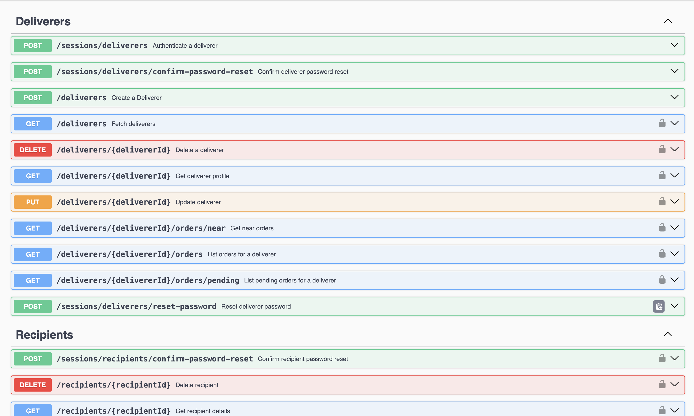

# Logistics API

This backend application is designed for managing deliveries, including features for tracking, updating delivery statuses, and managing couriers and recipients. The goal is to streamline the organization of deliveries and optimize the delivery process, providing a seamless and trackable experience for administrators, couriers, and recipients.


[](https://choosealicense.com/licenses/mit/)
[](https://nestjs.com/)
[](https://www.typescriptlang.org/)


## ✅ Setup

### Prerequisites

Ensure you have **Node.js** (v16 or later) and **Docker** installed on your machine.

#### 1. Clone the Repository

```bash
git clone <repository-url>
cd logistics-api
```

#### 2. Install Dependencies
Run the following command to install all required packages:
```bash
npm install
```

#### 3. Environment Configuration
Create a **.env** file in the root directory by copying the provided **.env.example** file:
```bash
cp .env.example .env
```

Then, configure the .env file with the following properties:
```bash
# General variables
PORT= # Port number the server will run on
FRONTEND_URL= # URL of the frontend application

# Authentication
JWT_PRIVATE_KEY= # Private key for JWT authentication
JWT_PUBLIC_KEY= # Public key for JWT authentication
GOOGLE_CLIENT_ID= # Google OAuth Client ID
GOOGLE_CLIENT_SECRET= # Google OAuth Client Secret
GOOGLE_REDIRECT_URL= # Google OAuth Redirect URL

# Database variables
DATABASE_URL= # Connection URL for the database
DB_USER= # Database username
DB_PASSWORD= # Database password
DB_NAME= # Database name
DB_PORT= # Port number for the database connection

# Mail service
MAIL_HOST= # Mail service provider host
MAIL_PORT= # Mail service port
MAIL_USER= # Mail service username
MAIL_PASS= # Mail service password

# Bucket credentials
CLOUDFLARE_ACCOUNT_ID= # Cloudflare account ID for the bucket
AWS_ACCESS_KEY_ID= # AWS access key for bucket operations
AWS_SECRET_ACCESS_KEY= # AWS secret access key for bucket operations
AWS_BUCKET_NAME= # Name of the storage bucket
```

#### 4. Run Docker

The next step is to start the Docker containers for any services (e.g., database, cache) defined in **compose.yml**:
```bash
docker compose up -d
```

#### 5. Database Setup
Run the Prisma migration and seed scripts to set up your database schema and populate initial data:
```bash
npx prisma migrate dev
npx prisma db seed
```
> **_NOTE:_**  Make sure your database credentials are correctly set in the .env file before running these commands.

#### 6. Starting the Application
Finally, start the application in development mode with:
```bash
npm run start:dev
```

#### 7. Running Tests
The application includes unit and end-to-end (e2e) tests. To run these tests, use the following commands:

* Run all unit tests:
```bash
npm run test
npm run test:watch
```

* Run all e2e tests
```bash
npm run test:e2e
npm run test:e2e:watch
```

#### Additional Considerations
* Code Linting: Make sure to run npm run lint to check code quality.
* Prettier: Run npm run prettier to format the codebase for consistent styling.

    ## 👨‍💻 API Routes & Documentation

### Accessing the API Documentation



The API documentation provides a comprehensive overview of all routes, request types, input parameters, and response structures for each controller within the application. Additionally, it includes support for JWT-based authentication to access protected endpoints.

To access the documentation, [click here](#).

- **Endpoints Overview**: Lists and describes each available API route.
- **Parameters & Types**: Details all required and optional parameters for requests, along with their data types.
- **Inputs & Outputs**: Specifies input validation rules and structures for expected outputs, making it easier to integrate with the API.
- **Authentication**: The documentation interface allows you to authenticate using a JWT, letting you explore protected endpoints as a logged-in user.

> **Note**: Make sure to have a valid JWT token if you need to test routes requiring authentication.
## 💻 Tech Stack

To this project, I have decided to keep things as simple as possible, therefore I developed the entire project following clean architecture, SOLID and DDD principles. Which means that you can transfer the bussiness logic to any javascript framework that you want.

As a boilerplate, this is the tech I have used:

- AWS SDK
- NestJS
- Passport Auth
- TypeScript
- Nodemailer
- Zod
- Vitest
- PrismaORM
- PostgreSQL
- Docker
- Redis
- Supertest
- Eslint
## Authors

- [@gustavogarciac](https://www.github.com/gustavogarciac)

### Special contributors
- [@RibarrJR](https://www.github.com/RibarrJR)
- [@borbabeats](https://github.com/borbabeats)

